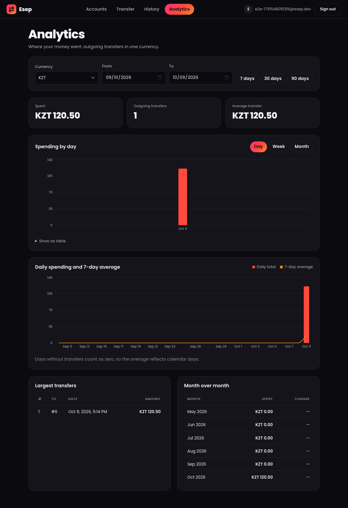
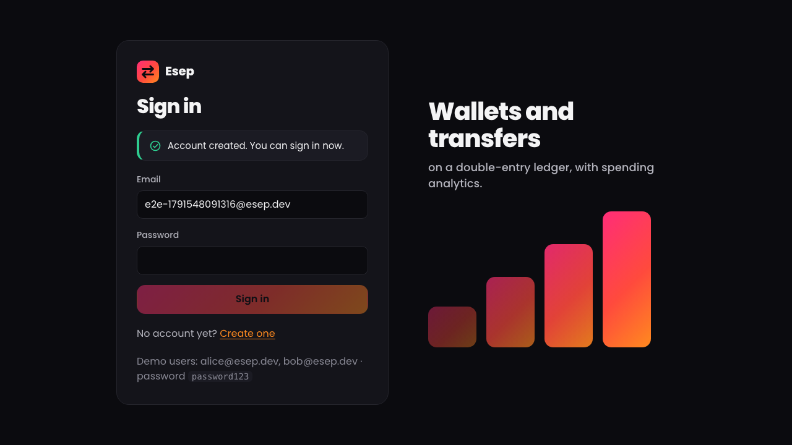
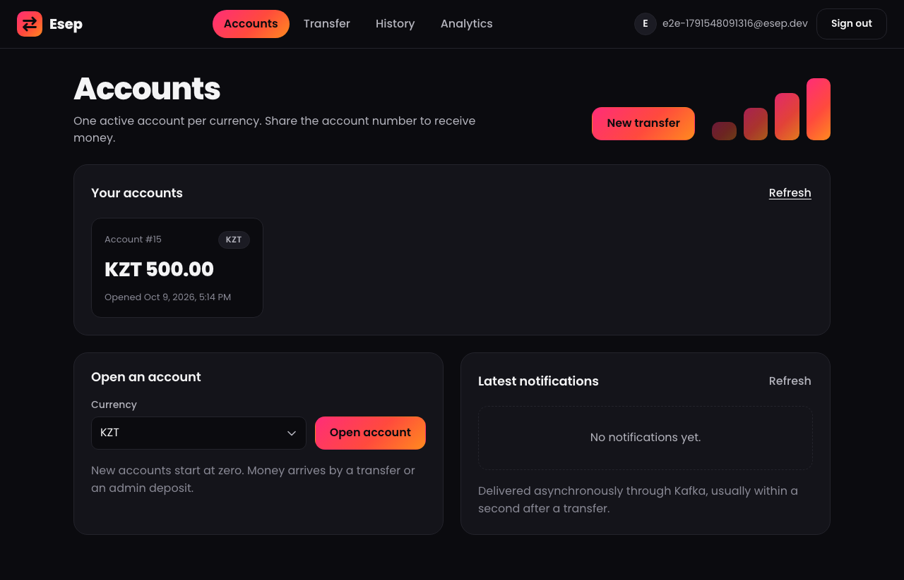
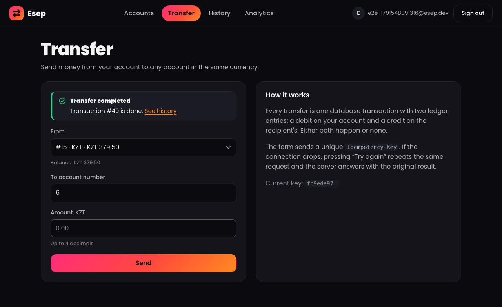
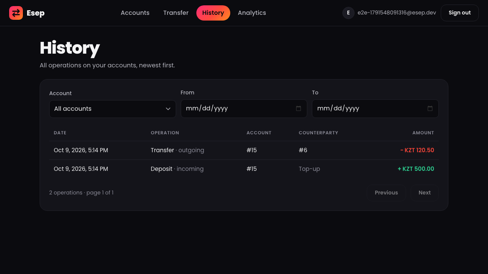
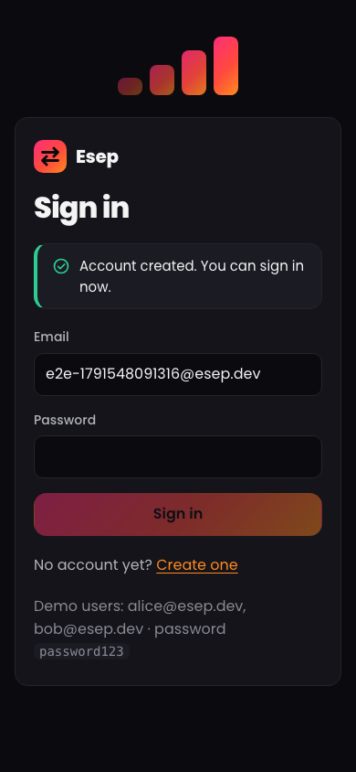
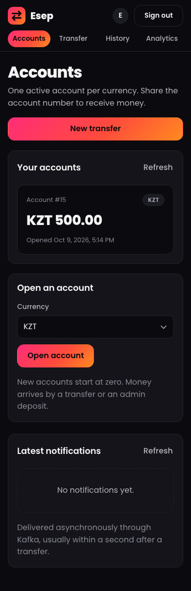
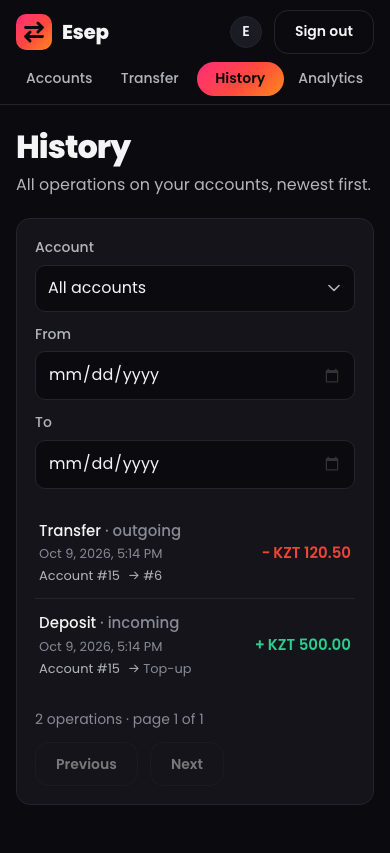
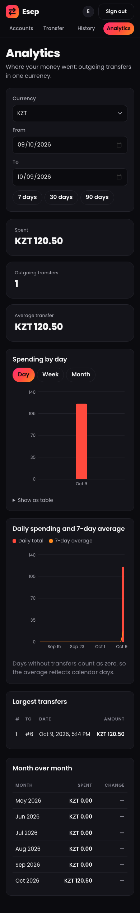

# Esep Web

[](https://github.com/Bakhyzh/esep-web/actions/workflows/ci.yml)
[](https://github.com/Bakhyzh/esep-web/actions/workflows/deploy.yml)

Frontend for **[esep-api](https://github.com/Bakhyzh/esep-api)**: wallets, transfers on a double-entry ledger
and spending analytics.

**Stack:** React 19 · TypeScript · Vite · React Router · Recharts · Vitest · Playwright · `fetch`



## Live demo

- App: _TODO: https://bakhyzh.github.io/esep-web/_
- API: _TODO: https://api.example.com/actuator/health_
- Demo login: _TODO: shared on request_

## Screens

| Screen | What it does |
|---|---|
| Sign in / Register | JWT login; the token is sent as `Authorization: Bearer ...` |
| Accounts | List of accounts with balances, open an account, close an empty one, latest notifications (delivered through Kafka) |
| Transfer | Send money; the client generates the `Idempotency-Key`, so "Try again" after a network error never pays twice |
| History | Operations of all accounts, newest first: pagination, account and date filters kept in the URL |
| Analytics | Spending by day/week/month, daily spending with a 7-day moving average, largest transfers, month over month |

Desktop (1280 px):

| | |
|---|---|
|  |  |
|  |  |

Phone (390 px):

| Sign in | Accounts | Transfer | History | Analytics |
|---|---|---|---|---|
|  |  |  |  |  |

Screenshots are taken by the smoke test: `E2E_SCREENSHOTS=1 npm run e2e` (both widths).

## Run locally

1. Start the backend (in the `esep-api` repository):

   ```bash
   docker compose up --build        # API on http://localhost:8081, allows CORS from http://localhost:5173
   ```

2. Start the frontend:

   ```bash
   cp .env.example .env             # VITE_API_URL=http://localhost:8081
   npm install
   npm run dev                      # http://localhost:5173
   ```

3. Sign in as `alice@esep.dev` / `password123` (or register a new user). Demo money comes from an admin
   deposit: `admin@esep.dev` / `password123` via Swagger (`POST /api/deposits`) or the Postman collection in esep-api.

> The dev server must run on port 5173: that is the origin the API allows (`CORS_ALLOWED_ORIGINS` in esep-api).

## Deployment (GitHub Pages)

`.github/workflows/deploy.yml` runs on every push to `main`: lint, unit tests, build, then publishes `dist/`
with `actions/upload-pages-artifact` + `actions/deploy-pages`.

- The app is served from `https://<user>.github.io/esep-web/`, so the production build uses `base: '/esep-web/'`
  (the dev server stays at `/`).
- Routing uses `HashRouter` (`/esep-web/#/accounts`): GitHub Pages has no SPA fallback, so a refresh on
  `/esep-web/accounts` with `BrowserRouter` would return 404.
- `VITE_API_URL` comes from the repository variable `vars.VITE_API_URL` (Settings → Secrets and variables →
  Actions → Variables), e.g. `https://api.example.com`. It is **not a secret**: everything in a frontend
  bundle is public. Never put secrets in `VITE_*` variables.
- One-time setup: Settings → Pages → Source: **GitHub Actions**. The API must allow the origin
  `https://<user>.github.io` (`CORS_ALLOWED_ORIGINS` in esep-api). Full checklist: esep-api `docs/DEPLOY.md`.

## Scripts

| Command | What it does |
|---|---|
| `npm run dev` | dev server with hot reload |
| `npm run build` | type check (`tsc -b`) + production build into `dist/` |
| `npm run lint` | oxlint |
| `npm test` | unit tests (Vitest): API client, error mapping, JWT expiry, amount validation |
| `npm run e2e` | Playwright smoke test against a running stack (`E2E_API_URL`, default `http://localhost:8081`); `E2E_SCREENSHOTS=1` also refreshes `docs/screenshots` |
| `npm run check` | lint + test + build |

## Configuration

| Variable | Default | Purpose |
|---|---|---|
| `VITE_API_URL` | `http://localhost:8081` | base URL of esep-api, read at build time (in CI: `vars.VITE_API_URL`) |

## Project structure

```
src/
  api/          client.ts (fetch wrapper, ApiError), esep.ts (endpoints), types.ts (DTOs)
  auth/         AuthProvider (token, expiry timer, 401 handling), useAuth, RequireAuth
  components/   Layout, Field, Alert, Pagination, chart tooltip, theme colors, logo and decor, icons
  lib/          formatting, error messages by code, JWT expiry, useApi (abortable loading)
  pages/        Login, Register, Accounts, Transfer, History, Analytics
  styles/       tokens.css: brand colors, radii, fonts (the only place colors are defined)
e2e/            Playwright smoke test
```

## Decisions and trade-offs

- **Errors by code, not by text.** The API returns `application/problem+json` with a stable `code`
  (`INSUFFICIENT_FUNDS`, `VALIDATION_FAILED`, ...). `lib/errors.ts` maps codes to messages; field errors
  are shown next to the inputs.
- **Idempotency-Key is generated by the client**, one per logical transfer. A retry after a network error,
  a 5xx or `CONCURRENT_MODIFICATION` reuses the key, so the server answers with the original result
  (`200` + `Idempotent-Replayed`). Editing the form or a successful transfer starts a new key.
- **Expired token.** The client reads `exp` from the JWT (without verifying it: only the server can) and logs
  out exactly at that moment; any `401` on an authenticated request also ends the session. The login page
  then explains that the session has expired.
- **Token in `localStorage`.** Survives a reload and keeps the backend stateless, but is readable by injected
  scripts (XSS). The alternative, an `httpOnly` cookie, needs CSRF protection and a cookie-based backend flow.
  Mitigations here: short-lived tokens (1 h), no third-party scripts, React escaping.
- **Money is sent as a string** (`"120.50"`), validated with the same rule as the backend (up to 4 decimals),
  so it never passes through a JS float on the way to the server.
- **Dates are calendar days in the browser's time zone.** The UI sends `zone=<IANA id>`; the API computes day
  boundaries in it.
- **Filters in the URL** (History): reload, back button and shared links keep them.
- **Abortable loading** (`useApi`): a newer request cancels the previous one, so a slow response cannot
  overwrite fresher data.
- **Charts** follow one-axis, thin-mark rules with the brand series colors (`--brand-2`, `--brand-3`), a legend
  for two series, tooltips and a table view; they skip animation when the OS asks for reduced motion.
  Recharts is lazy-loaded with the Analytics page (~110 kB gzip), so other pages load without it.
- **One dark brand theme** defined as CSS variables in `src/styles/tokens.css` (no UI library, no Tailwind).
  Poppins is bundled locally with `@fontsource/poppins` (latin subset), no Google Fonts request. The red-orange
  brand gradient is used only for primary buttons, the logo, the active menu item and decor; errors are always an
  icon plus text, and debit/credit amounts differ by sign (`−` / `+`), not only by color. Text pairs pass WCAG AA
  (lowest: `--danger` on cards, 4.9:1).
- **No state library.** Server data is loaded per page; there is little shared client state (only the session),
  so React context is enough.
